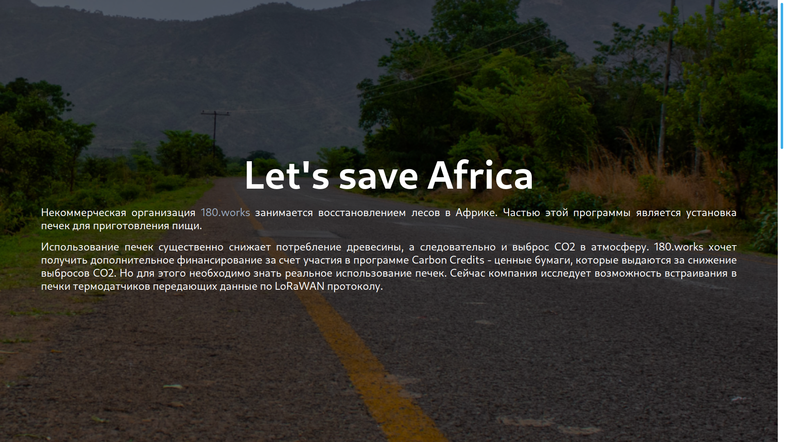
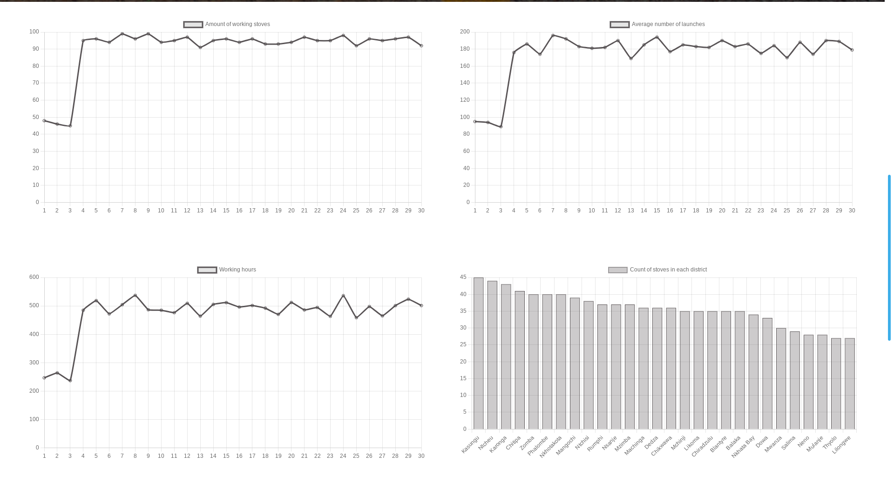
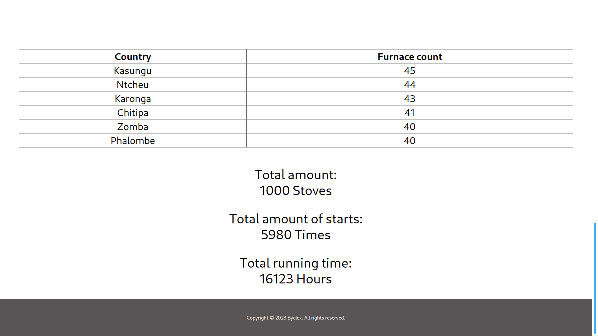

# 180works-carbon-offset
#### Project for summer practice after third course
# Description:
    180.works enables the reduction of greenhouse gas emissions by installing efficient cookstoves in rural communities. 180 cookstoves have a significant impact on the health and well-being of people and on the environment. Implementation has begun in Malawi.

# Installation:
    git clone git@github.com:GlobusOffZeWorld/180works-carbon-offset.git

# Instruments:
>-    GitHub
>-    React
>-    Django
>-    RabbitMQ
>-    PostgreSQL

# Contributing:
Team - 13 group 3 course BSU:

>- Arina Novik — Project Manager. 
>- Gleb Polyvyany — Team Lead, Front-end. 
>- Evgeny Belotelov — Software Engineer, Generating. 
>- Yana Nestyukovich — Software Developer, Generating.
>- Daniil Vasilyuchek — Software Engineer, Back-end.
>- Margarita Golubovich — Software Developer, Back-end.
>- Alexey Orlovich — Software Engineer, Back-end.